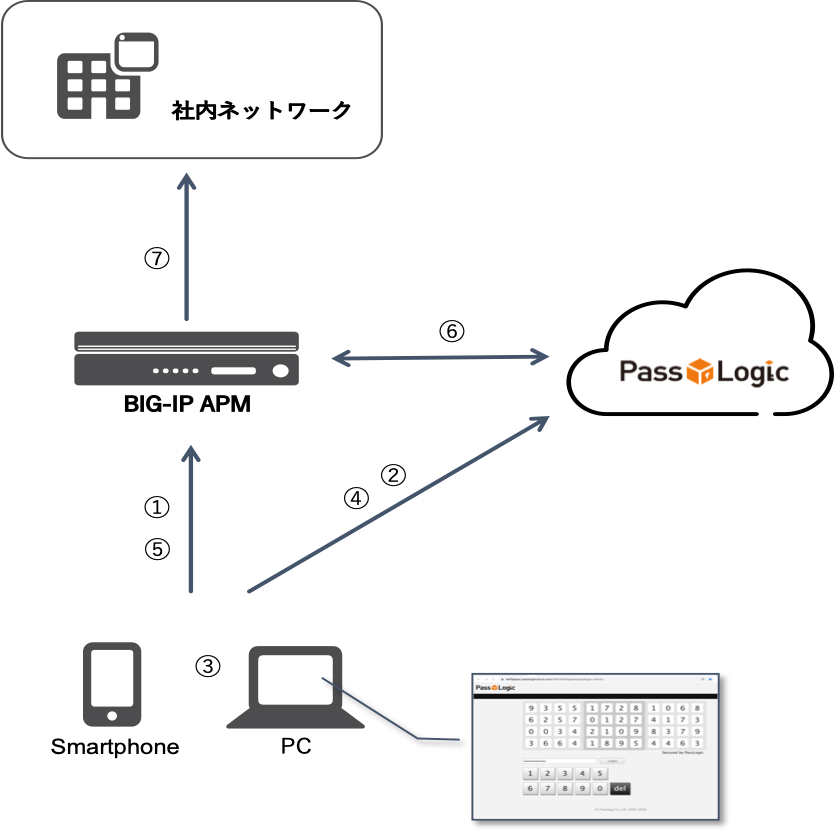

AWAFとは
======================================

F5 Advanced WAF（略してAWAF）とは、OWASP TOP10の攻撃、ウェブアプリケーションの脆弱性、ゼロデイ攻撃、L7レイヤのDDoS攻撃などからWEBアプリケーションを守る高度なウェブアプリケーションファイアウォールです。

AWAFであれば、スタンドアローン構成、BIG-IP LTM（ADC）にアドオンして利用する構成を取ることとが可能です。そして、オンプレでも、Public Cloud でもPrivate Cloudでも動作するため、デプロイ場所を選びません。

自社で柔軟なWAFポリシーを作成したいお客様、AWAFを利用して高度なWAFサービスを提供したいというサービス事業者様、そして、LTM導入済みでWAFを追加したいお客様など、幅広くご利用頂けます。

その他、AWAFの特長や利用メリットは以下の記事をご確認下さい。

- `K85426947: BIG-IP ASM operations guide <https://my.f5.com/manage/s/article/K85426947>`_

- `K07359270: Succeeding with application security <https://my.f5.com/manage/s/article/K07359270>`_
