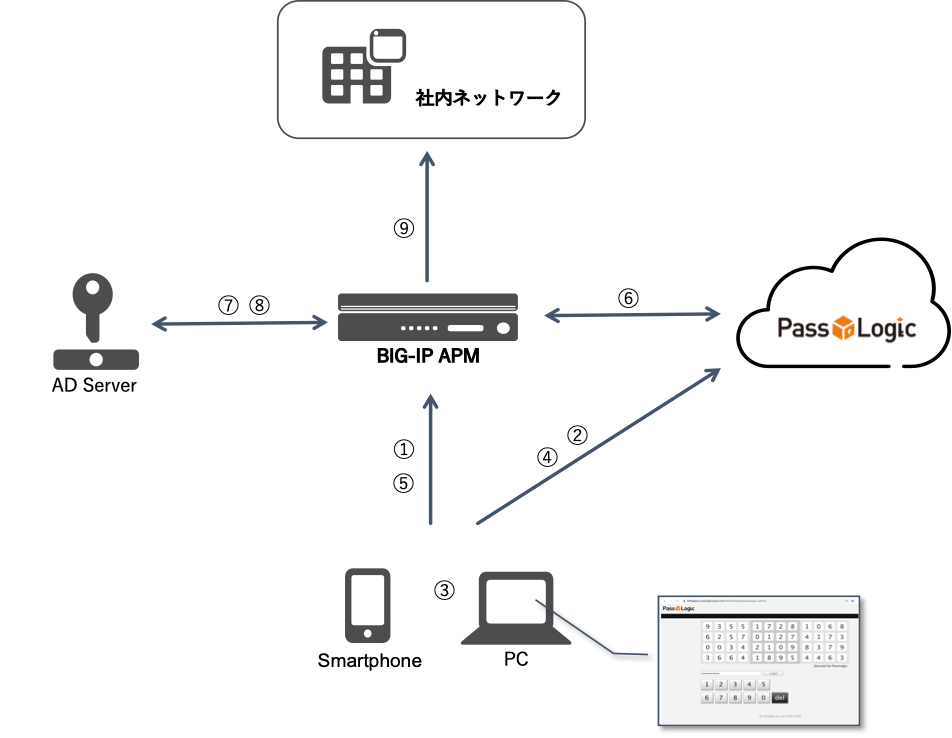

基本連携＋AD認証イメージ
======================================

APMとPassLogicクラウド版、ADサーバの連携の流れは以下の通りです。

#.	APMにブラウザまたはEdge Clientから接続
#. PassLogicクラウド版のトークンレス認証画面にリダイレクトされる
#. ユーザIDを入力し、マス目パターンのワンタイムパスワードを入力する
#. ワンタイムパスワードを送る
#. APMに再度リダイレクトされる（ID＆ワンタイムパスワードを送る）
#. APMからPassLogicクラウド版にRADIUS認証接続し、該当ユーザの認証状況とAttributeからAD Group情報を取得する
#. AD認証を実施する
#. AD Queryを実施し、⑥で取得したAttributeの情報がADユーザのグループ情報と同じか確認する
#. 7まで確認できたら、ADグループ毎のACLを適用したSSL-VPN接続を許可する

